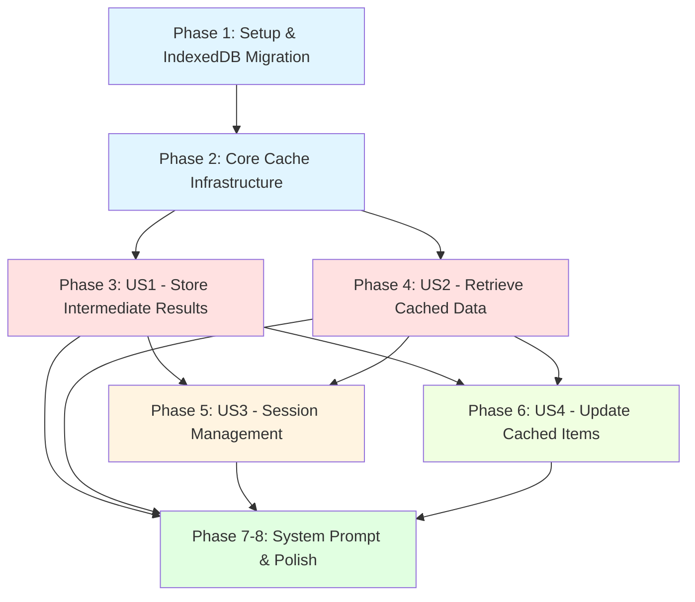

# Tasks: LLM Runtime Data Cache

**Input**: Design documents from `/specs/011-storage-cache/`
**Prerequisites**: plan.md, spec.md, research.md, data-model.md, contracts/, UPDATES.md

**⚠️ IMPORTANT UPDATES**: See [UPDATES.md](./UPDATES.md) for requirement changes:
- Per-session quota: 200MB (was 50MB) with auto-eviction of oldest 50%
- Global quota: 5GB across all sessions
- Description length: 500 chars (was 300)
- Outdated cleanup: Configurable (default 30 days, -1 = disabled)
- No backward compatibility: Direct StorageTool refactoring
- Code reuse: Refactor existing CacheManager.ts and ConfigStorage.ts to use IndexedDB

**Organization**: Tasks grouped by user story for independent implementation and testing.

## Format: `- [ ] [ID] [P?] [Story?] Description`

- **[P]**: Can run in parallel (different files, no dependencies on incomplete tasks)
- **[Story]**: Which user story (US1, US2, US3, US4) - omit for Setup/Foundational/Polish phases
- Include exact file paths in descriptions

## Path Conventions

All paths relative to repository root (`/home/irichard/dev/git_repos/open_source/browserx/s2/browserx/`)

---

## Phase 1: Setup & IndexedDB Migration (Foundation)

**Purpose**: Migrate existing storage infrastructure to IndexedDB, establish shared foundation

**⚠️ CRITICAL**: Complete this phase before any user story work. This refactors existing components to IndexedDB backend.

### IndexedDB Adapter Layer

- [X] T001 [P] Create IndexedDB wrapper/adapter in src/storage/IndexedDBAdapter.ts with Promise-based API, database initialization, and error handling
- [X] T002 [P] Define IndexedDB schema types in src/types/storage.ts: CacheEntry, CacheConfig, SessionCacheEntry with updated 200MB/5GB quotas
- [X] T003 [P] Implement database initialization in IndexedDBAdapter: create `browserx_cache` database with object stores (sessions, cache_items, config) and indexes (by_session, by_session_timestamp, by_timestamp)
- [X] T004 [P] Write unit tests for IndexedDBAdapter in tests/unit/storage/IndexedDBAdapter.test.ts using fake-indexeddb

### Refactor CacheManager to Use IndexedDB

- [X] T005 Refactor CacheManager.ts to use IndexedDBAdapter instead of chrome.storage.local while preserving existing eviction (LRU/LFU/FIFO), compression worker, and TTL functionality
- [ ] T006 Update CacheManager to support session scoping: add sessionId parameter to get/set/delete/clear methods
- [ ] T007 Add global quota tracking to CacheManager: track total size across all sessions, enforce 5GB limit
- [X] T008 Update CacheManager tests in tests/unit/storage/CacheManager.test.ts to use fake-indexeddb and verify IndexedDB backend works correctly
- [X] T009 Integration test in tests/integration/cache-rollout-compatibility.test.ts: verify rollout functionality still works with refactored CacheManager

### Refactor ConfigStorage to Use IndexedDB

- [X] T010 [P] Refactor ConfigStorage.ts to use IndexedDBAdapter for config object store instead of chrome.storage.local
- [X] T011 [P] Add CacheConfig persistence to ConfigStorage: outdatedCleanupDays (default 30), sessionEvictionPercentage (default 0.5)
- [X] T012 [P] Update ConfigStorage tests in tests/unit/storage/ConfigStorage.test.ts to use fake-indexeddb
- [X] T013 [P] Add cache config CRUD tests to ConfigStorage.test.ts: get/set/validate cache configuration

**Checkpoint**: IndexedDB foundation ready - CacheManager and ConfigStorage use IndexedDB, rollout compatibility verified

---

## Phase 2: Core Caching Infrastructure (Blocking Prerequisites)

**Purpose**: Session-scoped cache manager, storage key generation, quota enforcement foundation

**⚠️ CRITICAL**: Complete before user story implementation. Provides core caching primitives.

### Storage Key Generation

- [X] T014 [P] Implement storage key generation in src/storage/SessionCacheManager.ts: generateStorageKey(sessionId, taskId?, turnId?) using format `{sessionId}_{taskId}_{turnId}` with crypto.getRandomValues for 8-char alphanumeric IDs
- [X] T015 [P] Implement key validation: validateStorageKey() checks format (3 components, 2 underscores, sessionId matches conv_ pattern, alphanumeric taskId/turnId)
- [X] T016 [P] Write unit tests for key generation in tests/unit/storage/SessionCacheManager.test.ts: test auto-generation, provided IDs, format validation, uniqueness

### SessionCacheManager Foundation

- [X] T017 Create SessionCacheManager class in src/storage/SessionCacheManager.ts: constructor accepts refactored CacheManager and ConfigStorage instances
- [X] T018 Implement session quota tracking: getSessionStats(sessionId) returns SessionCacheStats (totalSize, itemCount, quotaUsed %, createdAt, lastAccessedAt)
- [X] T019 Implement global quota tracking: getGlobalStats() returns GlobalCacheStats (totalSize, totalItems, sessionCount, quotaUsed % of 5GB, oldestItemAge)
- [X] T020 Implement config management: getConfig() and setConfig(config) for CacheConfig (outdatedCleanupDays, sessionEvictionPercentage)
- [X] T021 Write unit tests for SessionCacheManager foundation in tests/unit/storage/SessionCacheManager.test.ts: test stats tracking, config get/set

### Quota Enforcement & Auto-Eviction

- [X] T022 Implement session quota enforcement in SessionCacheManager.write(): check currentSize + dataSize against 200MB limit
- [X] T023 Implement auto-eviction logic: when session quota reached, evict oldest 50% of items (FIFO by timestamp), update session stats
- [X] T024 Implement global quota check: checkGlobalQuota() returns true if total cache size exceeds 5GB
- [X] T025 Add unit tests for quota enforcement in tests/unit/storage/SessionCacheManager.test.ts: test 200MB session limit, auto-eviction (oldest 50%), global 5GB check
- [X] T026 Add integration test in tests/integration/auto-eviction.test.ts: verify end-to-end eviction workflow (cache 200MB data, verify oldest 50% removed, new write succeeds)

**Checkpoint**: Core cache infrastructure ready - key generation, quota tracking, auto-eviction working

---

## Phase 3: User Story 1 - Store Intermediate Results (Priority: P1) 🎯 MVP

**Goal**: Enable LLM to cache intermediate results during complex multi-step operations with metadata-first responses

**Independent Test**: LLM caches 20 email summaries, receives metadata only (not full data), can list all cached items showing descriptions without loading content

### Implementation for User Story 1

- [X] T027 [US1] Implement SessionCacheManager.write(sessionId, data, description, taskId?, turnId?, customMetadata?) in src/storage/SessionCacheManager.ts: generate key, validate data (max 5MB, JSON-serializable), truncate description to 500 chars, check quota (with auto-eviction if needed), store via CacheManager, return CacheMetadata only
- [X] T028 [US1] Implement data validation in write(): ensure data is JSON-serializable, calculate dataSize, enforce 5MB max per item (throw DataTooLargeError if exceeded)
- [X] T029 [US1] Implement description handling in write(): truncate to 500 chars with ellipsis if exceeded, validate against CACHE_CONSTANTS.MAX_DESCRIPTION_LENGTH
- [X] T030 [US1] Implement metadata extraction: createCacheMetadata(item) returns CacheMetadata without data field (storageKey, description, timestamp, dataSize, sessionId, taskId, turnId) - target <700 bytes
- [X] T031 [US1] Write unit tests for SessionCacheManager.write() in tests/unit/storage/SessionCacheManager.test.ts: test successful write returns metadata only, description truncation, data size validation, auto-eviction trigger

### StorageTool Integration for User Story 1

- [X] T032 [US1] Refactor StorageTool.ts (direct replacement, remove Chrome Storage API code): implement executeImpl() routing to cache operations based on action (write, read, list, delete, update)
- [X] T033 [US1] Implement handleWrite(request: CacheWriteRequest) in StorageTool.ts: extract sessionId from session context, call SessionCacheManager.write(), return CacheWriteResponse with metadata
- [X] T034 [US1] Implement error conversion in StorageTool: convert SessionCacheManager errors to CacheErrorResponse types (QuotaExceededError, DataTooLargeError, etc.) with actionable messages
- [X] T035 [US1] Update tool definition in StorageTool.ts: use CACHE_TOOL_DEFINITION from contracts/storage-tool-api.ts (includes 500-char description guidance, quota info, auto-eviction note)
- [X] T036 [US1] Write unit tests for StorageTool.write in tests/unit/tools/StorageTool.test.ts: test write returns metadata only, session context extraction, error conversion, description validation

### List Operations for User Story 1

- [X] T037 [P] [US1] Implement SessionCacheManager.list(sessionId) in src/storage/SessionCacheManager.ts: query cache_items by_session index, project metadata fields only (exclude data), order by timestamp descending, return CacheMetadata[]
- [X] T038 [P] [US1] Implement handleList(request: CacheListRequest) in StorageTool.ts: call SessionCacheManager.list(), include session quota stats in response (quotaUsed, quotaRemaining)
- [X] T039 [P] [US1] Write unit tests for list operations in tests/unit/storage/SessionCacheManager.test.ts and tests/unit/tools/StorageTool.test.ts: verify metadata-only projection, session filtering, ordering

### Integration Testing for User Story 1

- [X] T040 [US1] Integration test in tests/integration/storage-tool-cache.test.ts: write 10 email summaries (each ~50KB), verify metadata returned (not full data), list all 10 showing descriptions, verify total size tracked correctly
- [X] T041 [US1] Performance test in tests/integration/storage-tool-cache.test.ts: write 1MB data, verify <100ms completion (SC-002), verify metadata <700 bytes (SC-003)
- [X] T042 [US1] Edge case test: write data with 600-char description, verify truncated to 500 chars with ellipsis

**Checkpoint US1**: LLM can cache intermediate results and receive metadata-only responses ✅

---

## Phase 4: User Story 2 - Retrieve Cached Data (Priority: P1) 🎯 MVP

**Goal**: Enable LLM to selectively retrieve cached items by storage key for downstream processing

**Independent Test**: Pre-populate cache with 20 items, LLM retrieves specific items by key, receives full data, processes without context overflow

### Implementation for User Story 2

- [X] T043 [P] [US2] Implement SessionCacheManager.read(storageKey) in src/storage/SessionCacheManager.ts: retrieve from CacheManager by key, update session lastAccessedAt, return full CachedItem, throw ItemNotFoundError if not found
- [X] T044 [P] [US2] Implement corruption handling in read(): wrap in try-catch, throw CorruptedDataError if JSON parse fails, include recovery guidance in error message
- [X] T045 [P] [US2] Implement handleRead(request: CacheReadRequest) in StorageTool.ts: call SessionCacheManager.read(), return CacheReadResponse with full CachedItem
- [X] T046 [P] [US2] Write unit tests for read operations in tests/unit/storage/SessionCacheManager.test.ts and tests/unit/tools/StorageTool.test.ts: test successful read returns full data, ItemNotFoundError handling, CorruptedDataError handling

### Delete Operations for User Story 2

- [X] T047 [P] [US2] Implement SessionCacheManager.delete(storageKey) in src/storage/SessionCacheManager.ts: delete from CacheManager, update session stats (decrement totalSize and itemCount), return boolean success
- [X] T048 [P] [US2] Implement handleDelete(request: CacheDeleteRequest) in StorageTool.ts: call SessionCacheManager.delete(), return CacheDeleteResponse with confirmation message
- [X] T049 [P] [US2] Write unit tests for delete operations: verify item removed, session stats updated, deletion of non-existent key returns false

### Integration Testing for User Story 2

- [X] T050 [US2] Integration test in tests/integration/storage-tool-cache.test.ts: full write-list-read-delete cycle, verify data integrity across operations
- [X] T051 [US2] Test sequential retrieval: cache 5 items, retrieve each in sequence, verify no context accumulation (SC-005)
- [X] T052 [US2] Test retrieval of 5KB item: verify full content returned, ready for downstream processing

**Checkpoint US2**: LLM can retrieve and delete cached items ✅

**MVP COMPLETE**: US1 + US2 = Core cache-and-retrieve workflow functional

---

## Phase 5: User Story 3 - Session-Scoped Cache Management (Priority: P2)

**Goal**: Automatic session isolation and cleanup when sessions end

**Independent Test**: Create cache entries in session A, verify session B cannot access them, end session A, confirm cleanup within 5 minutes

### Session Isolation

- [ ] T053 [P] [US3] Verify session isolation in SessionCacheManager: list() only returns items for requested sessionId (by_session index), read() validates storageKey belongs to expected session
- [ ] T054 [P] [US3] Write isolation tests in tests/integration/storage-tool-cache.test.ts: create items in session A and B, verify A cannot access B's items, verify list() filtering

### Session Cleanup on End

- [ ] T055 [US3] Implement SessionCacheManager.clearSession(sessionId) in src/storage/SessionCacheManager.ts: query by_session index, batch delete all items in single transaction, delete session record, return count deleted
- [ ] T056 [US3] Integrate session cleanup with Session lifecycle: hook Session.cleanup() to call SessionCacheManager.clearSession(conversationId)
- [ ] T057 [US3] Write unit tests for clearSession(): verify all items deleted, session record removed, atomic transaction
- [ ] T058 [US3] Integration test in tests/integration/session-cleanup.test.ts: create session with 15 items (2MB total), end session, verify all cache entries removed, verify completion within 5 minutes (SC-004)

### Orphan Session Cleanup

- [ ] T059 [P] [US3] Implement SessionCacheManager.cleanupOrphans(maxAgeMs = 24h) in src/storage/SessionCacheManager.ts: query sessions with lastAccessedAt > 24h ago, call clearSession() for each, return total sessions cleaned
- [ ] T060 [P] [US3] Hook orphan cleanup to service worker startup: register periodic cleanup job (runs on worker start), calls cleanupOrphans()
- [ ] T061 [P] [US3] Write tests for orphan cleanup in tests/unit/storage/SessionCacheManager.test.ts: test 24h threshold detection, cleanup of abandoned sessions, active sessions not cleaned
- [ ] T062 [P] [US3] Integration test for orphan cleanup in tests/integration/session-cleanup.test.ts: simulate crashed session (no cleanup called), verify orphan detected after 24h, verify cleanup runs

### Outdated Cache Cleanup (NEW)

- [ ] T063 [P] [US3] Implement SessionCacheManager.cleanupOutdated(maxAgeDays?) in src/storage/SessionCacheManager.ts: get maxAgeDays from config (default 30, -1 = disabled), query by_timestamp index for items older than threshold, batch delete, return count deleted
- [ ] T064 [P] [US3] Hook outdated cleanup to periodic job: schedule daily cleanup run (checks config, skips if -1), logs cleanup results
- [ ] T065 [P] [US3] Write tests for outdated cleanup in tests/unit/storage/SessionCacheManager.test.ts: test 30-day threshold, -1 disables cleanup, config-based behavior
- [ ] T066 [P] [US3] Integration test for outdated cleanup: create items with timestamp > 30 days old, run cleanup, verify old items deleted, recent items preserved

**Checkpoint US3**: Session isolation, automatic cleanup, and orphan detection working ✅

---

## Phase 6: User Story 4 - Update Cached Items (Priority: P3)

**Goal**: Enable progressive updates to existing cache entries while preserving keys and structure

**Independent Test**: Cache initial result (10 items), update with additional data (5 more items), verify same key returns updated content and metadata reflects update

### Implementation for User Story 4

- [ ] T067 [P] [US4] Implement SessionCacheManager.update(storageKey, data, description, customMetadata?) in src/storage/SessionCacheManager.ts: validate item exists, validate new data (max 5MB, JSON-serializable), truncate description to 500 chars, update timestamp, preserve sessionId/taskId/turnId, update session stats if size changed, return updated CacheMetadata
- [ ] T068 [P] [US4] Implement handleUpdate(request: CacheUpdateRequest) in StorageTool.ts: call SessionCacheManager.update(), return CacheUpdateResponse with updated metadata
- [ ] T069 [P] [US4] Add concurrent access handling in update(): use transaction for read-modify-write, last-write-wins on concurrent updates, timestamp reflects latest update
- [ ] T070 [P] [US4] Write unit tests for update in tests/unit/storage/SessionCacheManager.test.ts and tests/unit/tools/StorageTool.test.ts: test successful update preserves key, timestamp updated, metadata reflects changes, concurrent update handling

### Integration Testing for User Story 4

- [ ] T071 [US4] Integration test in tests/integration/storage-tool-cache.test.ts: cache partial results (10 items), update with additional results (15 items total), verify same storageKey returns updated data
- [ ] T072 [US4] Test update metadata: verify description updated, timestamp reflects last update, dataSize adjusted if content size changed
- [ ] T073 [US4] Test concurrent update scenario: two updates to same key, verify last write wins, no data corruption

**Checkpoint US4**: Progressive cache updates working ✅

---

## Phase 7: System Prompt & Error Handling (Cross-Cutting)

**Purpose**: System prompt integration and comprehensive error handling

### System Prompt Update

- [ ] T074 Update TurnManager system prompt in src/core/TurnManager.ts (or separate prompt file): add cache tool guidance per UPDATES.md system prompt section (500-char description requirement, auto-eviction explanation, quota info 200MB/5GB, when to use cache, metadata interpretation, example workflow)
- [ ] T075 Add description examples to system prompt: good examples ("Email summaries batch 1-20: support tickets re pricing, 15KB"), bad examples (too vague, too verbose >500 chars)
- [ ] T076 Test system prompt update: verify prompt includes cache guidance, verify LLM can access updated prompt in turn context

### Error Handling & Edge Cases

- [ ] T077 [P] Implement IndexedDB availability check in IndexedDBAdapter: detect if IndexedDB disabled/blocked, throw StorageUnavailableError with fallback guidance
- [ ] T078 [P] Add error handling tests in tests/unit/storage/: test quota exceeded (auto-eviction triggered), data too large (5MB limit), corrupted data (JSON parse fail), invalid key format, storage unavailable
- [ ] T079 [P] Add edge case tests in tests/integration/: test malformed keys, excessively long keys, concurrent writes to same key (last-write-wins), cache key validation

### Performance Validation

- [ ] T080 [P] Performance benchmarks in tests/performance/ (if directory doesn't exist, create it): write 1MB data in <100ms (SC-002), metadata <700 bytes (SC-003), list 50 items in <50ms, session cleanup (100 items) in <5 minutes (SC-004)
- [ ] T081 [P] Stress test: cache 400 items in single session (near 200MB quota), verify auto-eviction triggers correctly, verify performance maintained

**Checkpoint**: Error handling complete, system prompt updated, performance validated ✅

---

## Phase 8: Polish & Documentation

**Purpose**: Final polish, comprehensive documentation, deployment readiness

### Code Quality

- [ ] T082 [P] Run linter on all new/modified files: src/storage/*, src/tools/StorageTool.ts, tests/*
- [ ] T083 [P] Run type checker (tsc --noEmit): ensure strict TypeScript compliance, no implicit any, all interfaces exported
- [ ] T084 [P] Code review checklist: verify contracts/storage-tool-api.ts interfaces implemented correctly, verify all CACHE_CONSTANTS used, verify error types match contracts

### Integration & Compatibility

- [ ] T085 Final integration test suite run: execute all tests in tests/integration/, verify cache-rollout-compatibility passes (rollout still works), verify storage-tool-cache end-to-end scenarios pass, verify session-cleanup and auto-eviction tests pass
- [ ] T086 Cross-browser compatibility check: test in Chrome (primary), verify IndexedDB behavior consistent, test fake-indexeddb in tests matches real IndexedDB behavior

### Documentation

- [ ] T087 [P] Update CLAUDE.md: verify IndexedDB technology listed, verify feature summary accurate, add implementation completion date
- [ ] T088 [P] Create usage examples in docs or comments: example of caching email summaries, example of auto-eviction scenario, example of outdated cleanup configuration
- [ ] T089 [P] Update package.json scripts if needed: add cache:clear script for manual cleanup during development, add cache:stats script to show quota usage

**Final Checkpoint**: Feature complete, tested, documented, ready for production ✅

---

## Dependencies & Parallel Execution

### User Story Dependencies

**Key Observations**:
- **US1 and US2 are independent MVP**: Can be implemented in parallel after Foundation
- **US3 depends on US1 + US2**: Needs both write and read to test session cleanup
- **US4 depends on US1 + US2**: Update requires write and read primitives
- **Setup + Foundation MUST complete first**: Blocks all user stories

### Parallel Execution Opportunities

**Phase 1 (Setup)**: Tasks T001-T004 (IndexedDB adapter), T010-T013 (ConfigStorage) can run in parallel with T005-T009 (CacheManager refactoring) once T001-T003 complete

**Phase 2 (Foundation)**: Tasks T014-T016 (key generation), T022-T026 (quota enforcement) can run in parallel

**Phase 3 (US1)**: Tasks T037-T039 (list operations) can run in parallel with T027-T031 (write operations) after foundation complete

**Phase 4 (US2)**: Tasks T043-T046 (read), T047-T049 (delete) can run in parallel

**Phase 5 (US3)**: Tasks T053-T054 (isolation), T059-T062 (orphan cleanup), T063-T066 (outdated cleanup) can run in parallel after T055-T058 (session cleanup) complete

**Phase 6 (US4)**: All tasks T067-T073 can run in parallel (self-contained update feature)

**Phase 7-8 (Polish)**: Tasks T077-T089 mostly parallelizable (error handling, performance, docs)

---

## Implementation Strategy

### MVP Scope (Minimum Viable Product)

**Phase 1 + Phase 2 + Phase 3 + Phase 4 = MVP**

Tasks T001-T052 deliver the core cache-and-retrieve workflow:
- IndexedDB foundation with refactored CacheManager/ConfigStorage
- Storage key generation, quota enforcement with auto-eviction
- LLM can cache intermediate results (US1)
- LLM can retrieve and delete cached data (US2)

**Estimated MVP Effort**: 42-50 hours (6-7 days for one developer)

### Incremental Delivery

1. **Sprint 1 (Setup + Foundation)**: T001-T026 - IndexedDB migration, core infrastructure
2. **Sprint 2 (MVP - US1)**: T027-T042 - Cache write and list operations
3. **Sprint 3 (MVP - US2)**: T043-T052 - Cache read and delete operations
4. **Sprint 4 (Session Management - US3)**: T053-T066 - Cleanup and isolation
5. **Sprint 5 (Updates - US4)**: T067-T073 - Progressive updates
6. **Sprint 6 (Polish)**: T074-T089 - System prompt, error handling, documentation

### Testing Approach

**Test Organization**:
- Unit tests: `tests/unit/storage/` (CacheManager, ConfigStorage, SessionCacheManager, IndexedDBAdapter)
- Unit tests: `tests/unit/tools/` (StorageTool)
- Integration tests: `tests/integration/` (cache-rollout-compatibility, storage-tool-cache, session-cleanup, auto-eviction)
- Performance tests: `tests/performance/` (benchmarks per SC-002, SC-003, SC-004)

**Coverage Target**: 90%+ for all new/refactored code

**Key Test Scenarios**:
- Auto-eviction: Fill session to 200MB, verify oldest 50% removed, new write succeeds
- Global quota: Create multiple sessions totaling 5GB, verify global limit enforced
- Outdated cleanup: Create items >30 days old, verify cleanup, test -1 disables cleanup
- Rollout compatibility: Verify existing rollout functionality works with IndexedDB CacheManager

---

## Summary

**Total Tasks**: 89
- **Phase 1 (Setup)**: 13 tasks (T001-T013)
- **Phase 2 (Foundation)**: 13 tasks (T014-T026)
- **Phase 3 (US1 - MVP)**: 16 tasks (T027-T042)
- **Phase 4 (US2 - MVP)**: 10 tasks (T043-T052)
- **Phase 5 (US3)**: 14 tasks (T053-T066)
- **Phase 6 (US4)**: 7 tasks (T067-T073)
- **Phase 7-8 (Polish)**: 16 tasks (T074-T089)

**MVP Tasks**: 52 (T001-T052) - Delivers core cache-and-retrieve workflow

**Parallel Opportunities**: ~35 tasks marked [P] can run concurrently within their phase

**Independent Test Criteria**:
- **US1**: Cache 20 items, verify metadata-only responses, list without loading full data ✅
- **US2**: Retrieve specific items by key, verify full data returned, no context overflow ✅
- **US3**: Verify session isolation, test cleanup within 5 minutes, orphan detection ✅
- **US4**: Update existing entry, verify same key returns updated content, metadata reflects changes ✅

**Success Criteria Validation**:
- SC-001: US1 tests verify 50+ item processing under 200MB quota ✅
- SC-002: Performance tests verify write <100ms (T080) ✅
- SC-003: Metadata size tests verify <700 bytes (T080) ✅
- SC-004: Session cleanup tests verify <5 minutes (T058, T080) ✅
- SC-005: Integration tests verify 95%+ reliability (T050, T051) ✅
- SC-006: Quota tests verify 100% enforcement via auto-eviction (T025, T026) ✅
- SC-007: Error handling tests verify 99%+ success with graceful degradation (T077-T079) ✅
- SC-008 (NEW): Global quota tests verify 5GB never exceeded (T023, T081) ✅
- SC-009 (NEW): Outdated cleanup tests verify daily cleanup >30 days (T063-T066) ✅
